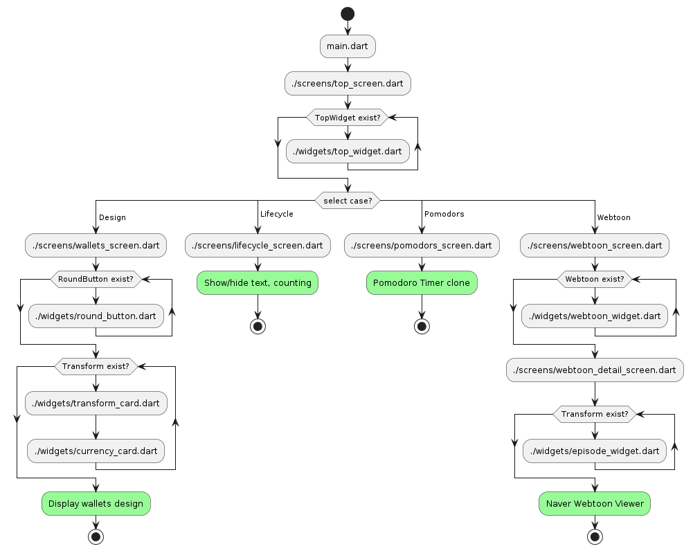
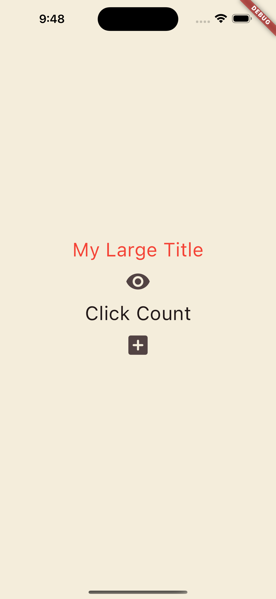
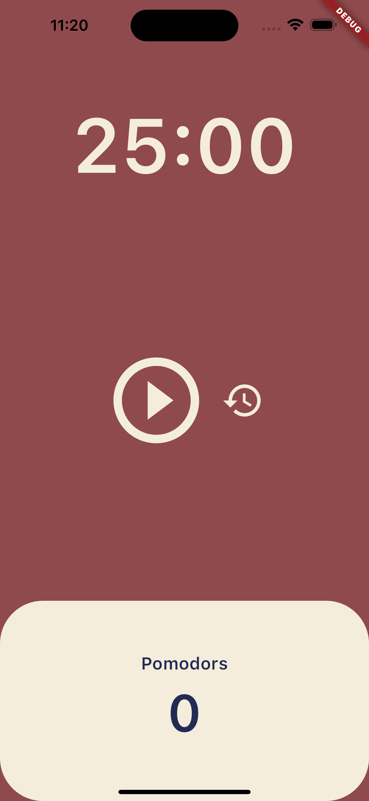
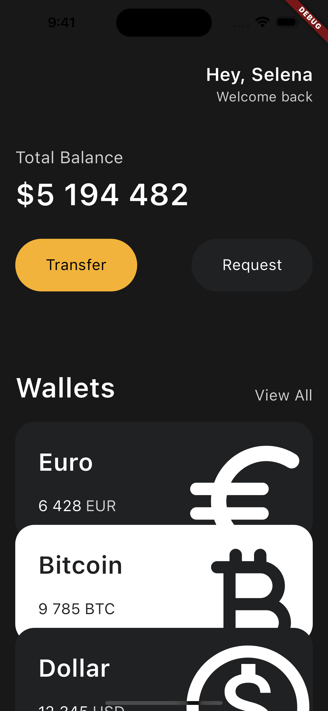
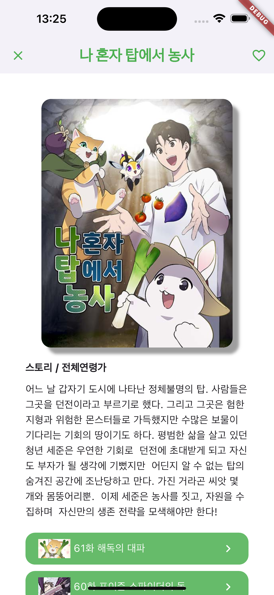

# toonflix

A new Flutter project.

## Getting Started

```sh
❯ flutter --version
Flutter 3.22.2 • channel stable • https://github.com/flutter/flutter.git
Framework • revision 761747bfc5 (3 weeks ago) • 2024-06-05 22:15:13 +0200
Engine • revision edd8546116
Tools • Dart 3.4.3 • DevTools 2.34.3
```

## Flow



## 内容

- Design
  - 
- Lifecycle
  - 
- Pomodors
  - 
- Webtoon
  - 
  - 
